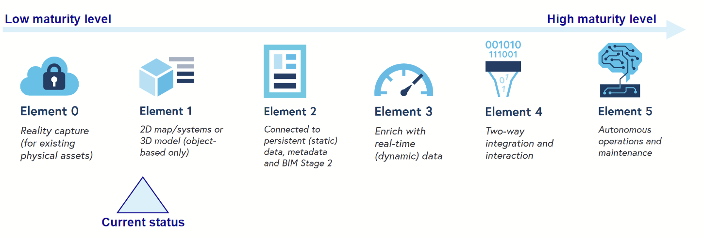
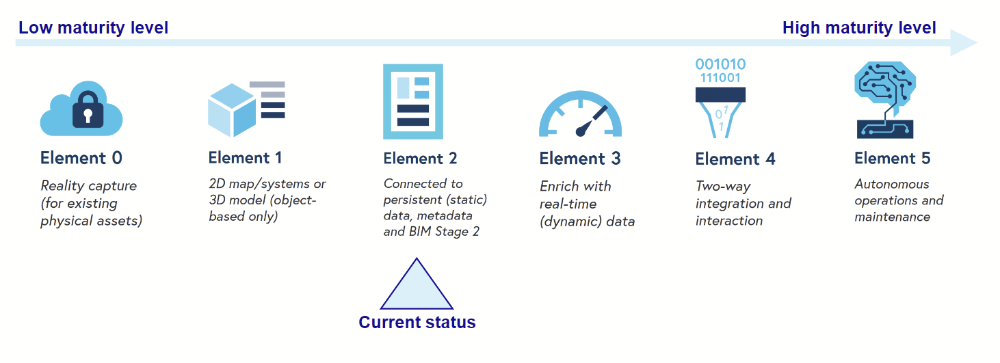

# Maturity analysis

### Data visualisation

In terms of the level of maturity in the data visualization field, some respondents mentioned using 3D or BIM data in their processes. However, the majority of respondents still do not make reference to 3D or BIM models, despite having the technical capacity to do so.

The current status of Data visualization is early 1.

To increase the maturity level, the following steps should be taken:

- Generalized 3D data collection on the field or processing based on alternative dataset (eg. lidar).
- Promote the usage and best practices of BIM methodology through the use of cases, standardization, knowledge transfer, and promotion within GIS units.
- Promote the usage of augmented and virtual reality through the use of cases, standardization, knowledge transfer, and promotion within GIS units.

### Data accessibility and management

In the context of an urban digital twin, data accessibility and management are intricately linked, as the successful operation of the digital twin hinges on the effective organization, maintenance, and availability of data. Data management practices are vital for aggregating, cleansing, and integrating diverse data sources, ensuring data quality, and supporting real-time updates. Simultaneously, data accessibility enables stakeholders such as urban planners, government agencies, and the public to interact with and extract valuable insights from the digital twin. Without proper data management, the digital twin's accuracy and usefulness may be compromised, while inadequate data accessibility could limit its potential impact on urban planning, decision-making, and the overall management of the urban environment.

The survey highlights the respondents' acceptance of the concept of data openness, as most of them provide open data. There is some attention given to metadata, with a nationwide program in Switzerland improving data referencing. However, the means of data transfer are not fully dynamic and mostly rely on regular or manual file transfer. The Urban Digital Twin concept aims to promote a more integrated approach to data sharing.

Additionally, the survey emphasizes the importance of standardization in data management. The majority of respondents clearly indicated that they would not develop a new data model without considering what already exists in the field. 

Within the organization, data accessibility is currently, most of the time,  centrally managed by the GIS unit. This limits the flexibility of business specialists to implement new data services or updates. In an Urban Digital Twin concept, both spatial (geo) and non-spatial (non-geo) data should be transferred and exchanged between systems. However, the current silo approach may prioritize non-geo data at the expense of pure geo data. This approach may not be sustainable, and a more integrated data management approach, such as a Data Mesh, should be implemented.

To increase the maturity level, the following steps should be taken:

- Promote the real-time transfer of data within and outside organizations based on web services  It facilitates timely access to critical information, enabling rapid responses to urban challenges, enhancing situational awareness, and supporting data-driven decision-making for urban planning and management. This can be achieved by implementing some flagship project, use cases and knowledge sharing.
- Explain and illustrate the data mesh principle and how it can address governance needs through "federated computational governance" (a set of policies, processes, and mechanisms that govern how data is managed and used across decentralized organizations). This involves coordination and collaboration among these domains to ensure consistent and secure treatment of data, regardless of its origin.

### Data Interoperability

This theme highlights the overall inflexibility of geodata platforms when it comes to incorporating new data types. While many respondents mentioned the capability to handle OGC standard file formats, these platforms appear to be limited to traditional forms of geodata and do not include other types such as social data, IoT, or citizen report data.

To increase the maturity level, the following steps should be taken:

- Promote the usage of new types of data, such as social media or citizen reports, to better include citizens in decision-making and enhance communication. This can be achieved through the use of use cases and technology sharing.
- Promote the usage of other type of non spatial data to add extra context. Adding non-spatial types of data (e.g., demographic, economic, or social data) in an urban digital twin is crucial to provide a comprehensive understanding of the urban environment, enabling holistic decision-making that incorporates not only physical aspects but also the social and economic factors that shape urban life and development.
- Utilize more IoT-type data and on-field sensors to monitor the real-time dynamics of the urban environment. This can be accomplished through the use of use cases and technology sharing.

### Data processing

While the other themes primarily centered around data acquisition and management, this theme now shifts its focus to the potential applications of the data. In an urban digital twin context, effective big data processing becomes essential, enabling the seamless integration, analysis, and utilization of the extensive and diverse data generated in urban environments to guide decision-making, enhance resource allocation, and improve urban quality of life.

In the urban digital twin context, this theme brings attention to significant trends and hurdles. To start, organizations frequently depend on more robust workstations to surmount computational constraints, yet there is also an increasing curiosity regarding cloud and cluster solutions. Furthermore, the survey indicates a gap in understanding real-time or big data processing tools, whereas conventional geoprocessing applications seem to be widely recognized. Additionally, the adoption of machine learning (GeoAI) faces obstacles due to perceived knowledge and resource limitations, despite its proven adaptability in tackling various geospatial challenges, including urban planning and environmental monitoring.

To increase the maturity level, the following steps should be taken:

- Clarify and advocate for the utilization of AI and machine learning to illustrate their potential value addition, which can be achieved through sharing code and models, as well as conducting training sessions and workshops
- Encourage the adoption of big data technology and processing to ensure the efficient handling of data, eliminating any potential application bottlenecks by offering efficient tools for processing large datasets.

## Conclusion

In conclusion, the survey findings shed light on several critical aspects of data management and utilization in the context of urban digital twins. The assessment of data visualization maturity indicates a growing interest in 3D and BIM data, suggesting a potential avenue for further development. However, there remains room for improvement in maximizing the use of these technologies. Data accessibility and management emerge as fundamental components, with the importance of data openness and standardization highlighted. The transition toward real-time data transfer and the exploration of the data mesh principle present opportunities for enhanced data governance and collaboration. Furthermore, data interoperability faces challenges in incorporating new data types, emphasizing the need to broaden data sources to include social, IoT, and citizen report data. Lastly, the theme of data processing underscores the growing interest in AI, machine learning, and big data technologies, suggesting the potential for significant advancements in urban data analysis and decision-making. To advance the maturity levels across these themes, it is imperative to promote knowledge sharing, training, standardization, and technology adoption, ensuring urban digital twins can reach their full potential in shaping the future of urban planning and management.