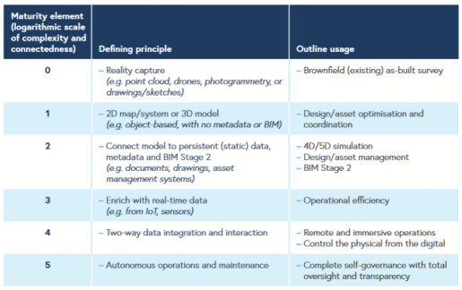
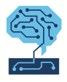

# Introduction 

The objective of this project is to assess and enhance the level of expertise and capability within the Swiss public administration concerning the implementation and utilization of Urban Digital Twin technologies, specifically from a Geographic Information Systems (GIS) standpoint. The project aims to evaluate the current maturity level of the Swiss public administration in this domain, including their proficiency in integrating diverse data sources, developing comprehensive virtual representations of urban environments, and utilizing GIS technology for effective urban planning and management. Through this assessment, the project seeks to identify areas of improvement and provide recommendations for enhancing the Swiss public administration's maturity in utilizing Urban Digital Twin methodologies from a GIS perspective.

# Maturity models

To assess and enhance the level of expertise and capability within the Swiss public administration concerning the implementation and utilization of Urban Digital Twin technologies, it is essential to select a suitable and standardised maturity spectrum. Maturity models are used to assess processes, organizations and systems against a norm and so identify the potential for improvements. These models, which originated in the software industry for improving software development and maintenance (Paulk et al., 1993), are a common topic of discussion in digital twin academic and professional literature (Davila Delgado & Oyedele, 2021). By defining a series of progressive phases that outline required capabilities, digital twins’ maturity models facilitate tracking, benchmarking and achieving technological advances [(Evans 2019)](https://www.zotero.org/google-docs/?0uoYjk)

Several digital twin maturity models and classifications have been compiled by Masoumi (2022).

We opted to adopt the maturity spectrum suggested by the Institution of Engineering and Technology (IET) for this project. The decision was driven by the fact that this model exhibits greater detail compared to the others and has been utilized in numerous scientific publications. This particular spectrum offers a well-defined and industry-agnostic framework that encompasses six development elements, providing clear requirements and desired outcomes.

## **Digital twin maturity spectrum**

The text in the following paragraph has been taken from [(Evans 2019)](https://www.zotero.org/google-docs/?ZHNLlW).

Here is a detailed view of the maturity elements :

### **Element 0**

*Reality capture (for existing physical assets)*

The lowest order element to start a digital twin (relevant only on existing physical assets) is creation of an accurate, as-built data set of the asset geometry or system design. This is the foundational element, over which data is connected and overlaid.

Data is collected through a variety of survey and reality capture techniques (such as point cloud scanning, drones, photogrammetry, drawings/sketches, etc) which are more accurate, efficient and cost-effective than was possible just a few years ago, and significantly more so than traditional survey methods.

Equally, for certain situations or assets a drawing or sketch might be an appropriate method of reality capture.

Element 0 immediately provides value through having greater asset certainty, spatial context and understanding. This is particularly true in sectors where a high proportion of assets are built and ageing, or in high-hazard sectors where it reduces worker exposure to dangerous tasks. Sometimes it’s appropriate to work within these point-cloud datasets, but often there is significant value in going to the next level of maturity.

### **Element 1**

*2D map/systems or 3D model*

Element 1 is the typical entry-point for new assets as an outcome of the design process and is often updated through reality capture (as per Element 0) post-construction to create the as-built model.

Models are purely object-based (surface, shapes, etc), with no metadata or BIM information attached. Point-clouds from Element 0 can be proportionally converted, as and when required, into object-based 2D map/systems or 3D models. The conversion is largely a manual process today but will soon be done through semi-automated methods involving machine learning.

At this level of maturity, the twin provides significant value through design/asset optimisation and coordination, answering questions, such as: is there space to run a new line through that module? And how would the maintenance team conduct that task?

### **Element 2**

*Connected to persistent (static) data, metadata and BIM Stage 2*

Further benefits are realised when Element 1 is connected to persistent data-sets, such as design information, material specifications, inspection reports, and asset management information; and further enriched with metadata (i.e. BIM). The data is added, tagged and pulled from existing systems, not embedded or stored in the 2D/3D model directly.

This provides the basis for engineering, project planning, operations, maintenance and decommissioning. It creates a single reference point from which all data can be viewed and interrogated, reducing errors, uncertainties and costs. It enables faster decision making and collaboration; answering questions such as: Are we on target with our schedule and budget? Where are the highest risk items?

Having a data model of this maturity also allows integrated multi-physics, multi-scale, probabilistic simulations to be run against the asset, either directly in the twin or through connected simulation applications; answering ‘what if’ questions such as: If I change X how will it impact Y?

### **Element 3**

*Enrich with real-time (dynamic) data*

Facilitated by sensors, connected devices and the Internet of Things (IoT), dynamic or operational data is obtained and displayed in real (or near-real) time through one-directional flow from the physical to the digital asset. This data can be analysed to inform and predict the behaviour of the built asset, and facilitate decision making, with the output or results fed back and updated into the organisation’s existing systems.
This element of maturity is what many technology and service providers would identify as the starting point of a ‘true’ digital twin, though getting to this level of maturity requires several previous steps that are often not detailed.
Developing Element 3 requires sensors and connected devices to actively or passively capture and collect data. This is often the first significant investment.

### Element 4

*Two-way integration and interaction*

The state and condition of the physical asset can be changed via the twin, with output and results fed back and updated into the twin. For example, an operator could manipulate a physical valve or activate machinery by initiating the action from the twin. This level of integration requires additional sensor and mechanical augmentation of the physical asset. 

This integration can also apply between the twin and other digital assets, such as other twins or even engineering systems and applications. For example, a designer using immersive technology modifies the design, the change is pushed to all connected applications, including the engineering design and process simulation package. The connected applications calculate the impact of the change and update the geometry and data accordingly, with these updates and their impact reflected live into the twin for the designer to see. 

This full integration demonstrates the two methods of interacting with digital twins; human-to-machine and machine-to-machine.

### Element 5

*Autonomous operations and maintenance*

In the future it’s not hard to imagine that the digital twin learns and evolves as a living repository for institutional knowledge, absorbing enough experience about the behaviour of the physical asset that it could become completely autonomous in its operations, able to react to anomalies and upsets and can take the necessary corrective action with little or no human interaction.

Achieving this level of maturity is purely aspirational at present, with only small facets of it for discrete situations possible now. The full ramifications of what Element 5 maturity means, and the quantifiable benefits it will bring, are yet to be fully understood.